<div align="center">

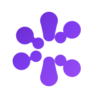

# Ponder

**The place where a question turns into an exploration, and an exploration turns into understanding.**

A local-first, AI-native **thinking & learning environment** — conversation-first like a modern AI assistant,
source-aware like a research tool, and spatial like a mind map. Ask anything, then branch, visualize,
challenge, practice, and remember — all on an infinite canvas that grows with your curiosity.

[Features](#-features) · [Quick start](#-quick-start) · [How it works](#-how-it-works) · [Architecture](#%EF%B8%8F-architecture) · [Roadmap](#%EF%B8%8F-roadmap)

  

</div>

---

## Screenshots

| | |
|---|---|
| **Home — start with curiosity** | **Infinite canvas — thinking, mapped** |
| 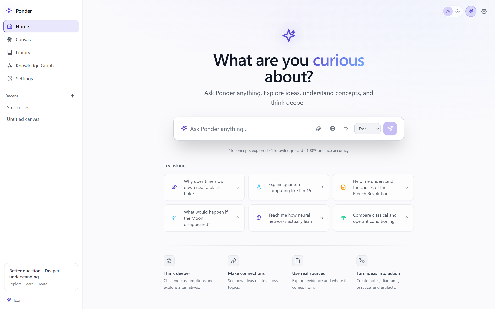 | 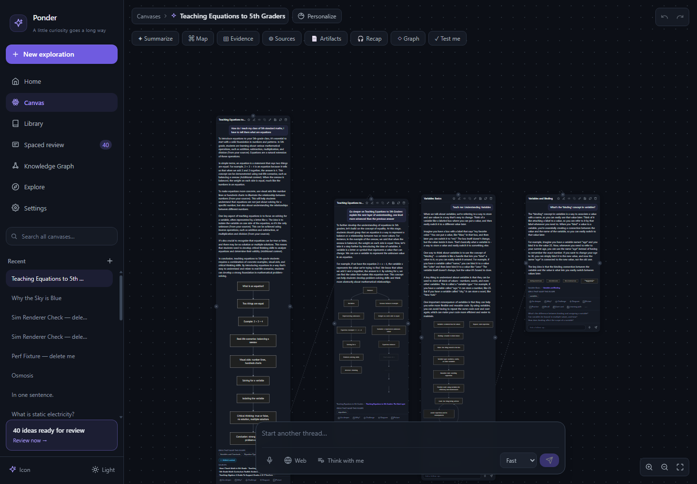 |
| **Knowledge graph — what you've explored, connected** | **Home — dark mode** |
| 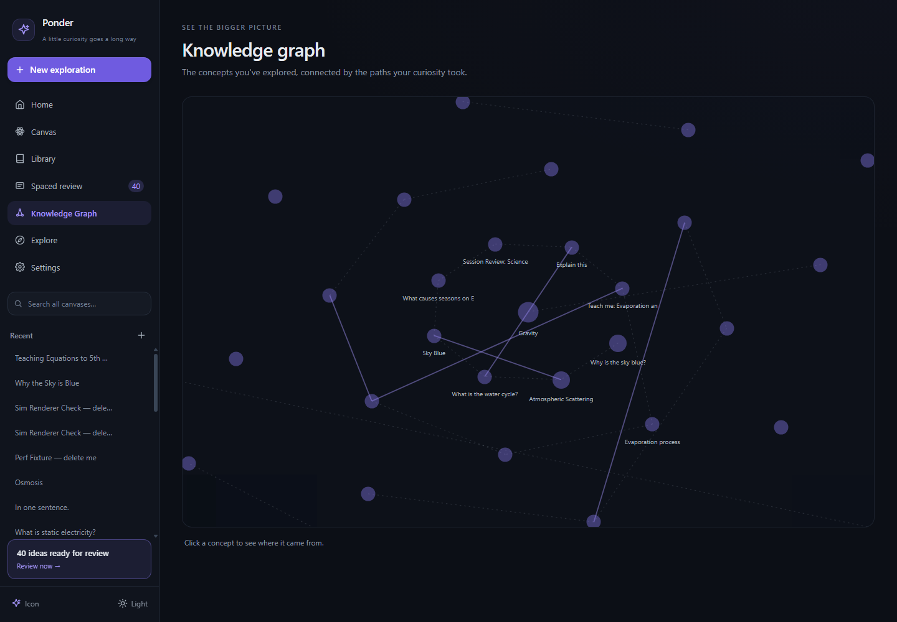 | 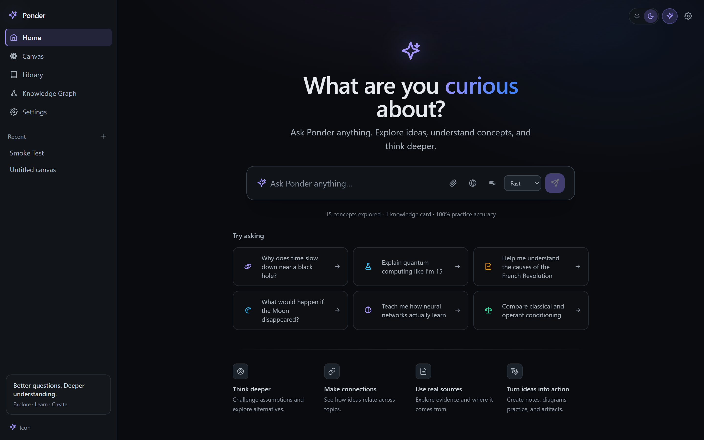 |
| **Canvas — light mode** | **Library — saved ideas, cards, sources** |
| 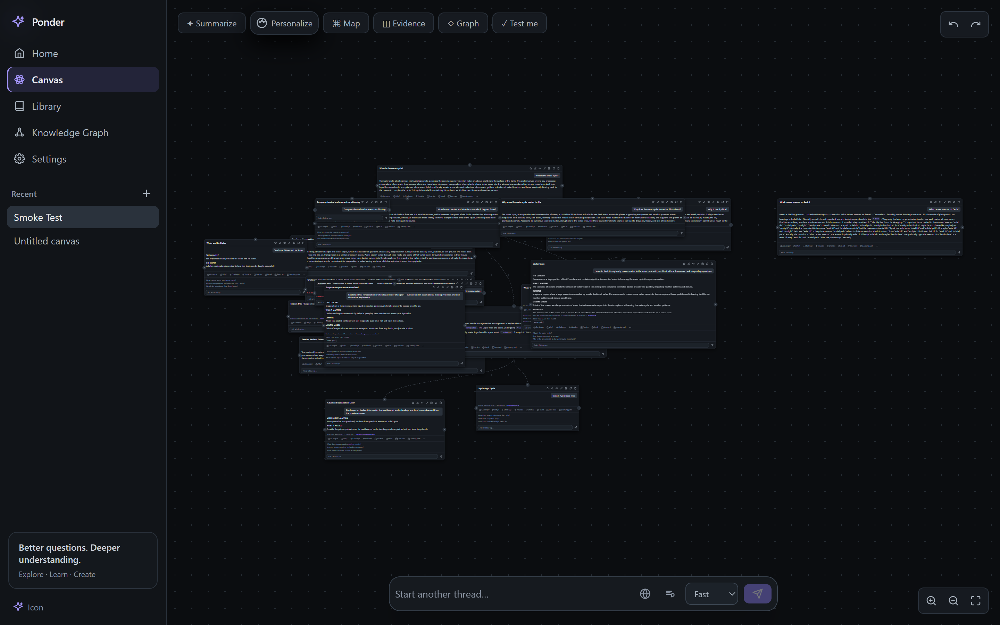 | 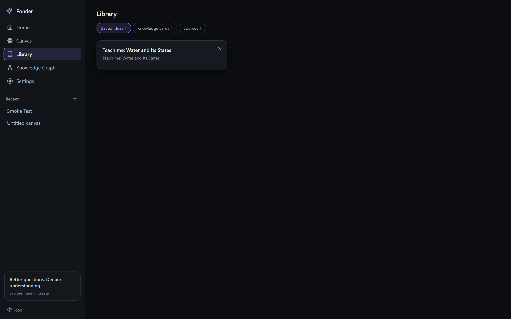 |
| **Settings — AI connections and models** | **Appearance — choose your workspace** |
| 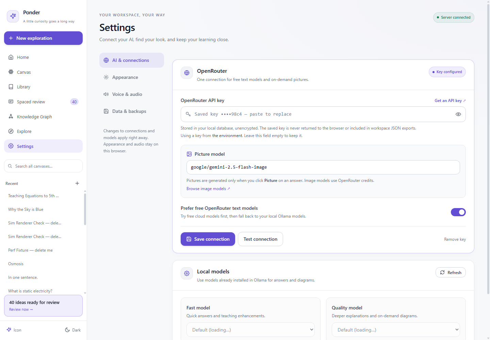 | 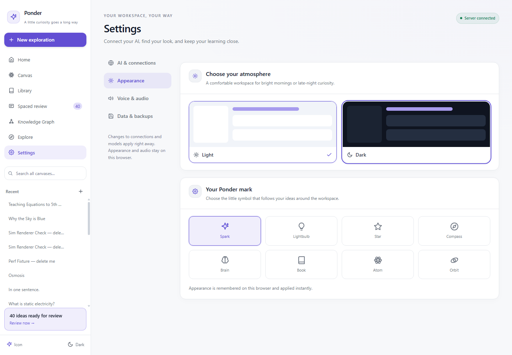 |
| **Canvas history — grid view** | **Canvas history — list view** |
| 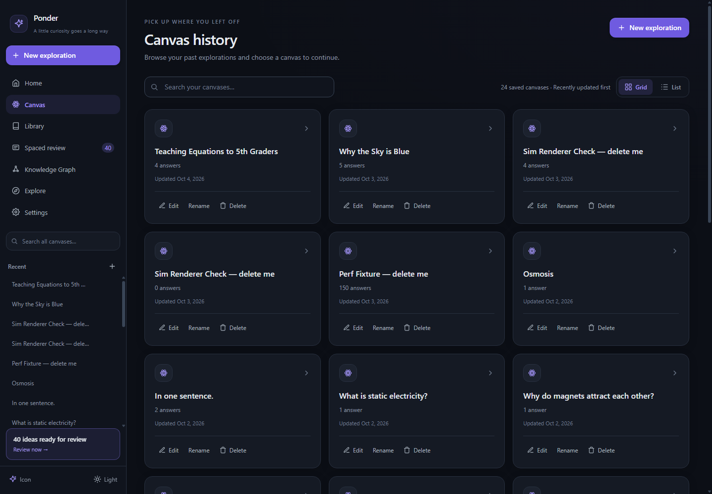 | 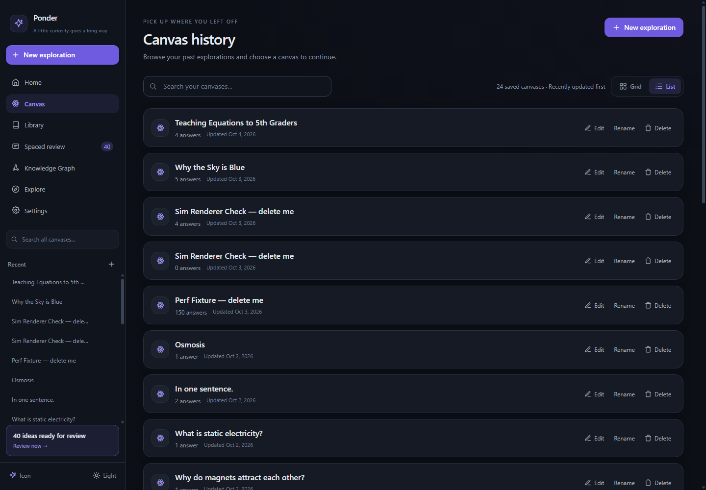 |

*Every screenshot is captured from a real running instance — no mock data anywhere in Ponder.*

## Why Ponder?

Most AI tools stop at the answer. Ponder treats the answer as a starting point:

> **Question → Conversation → Context → Branch → Visualize → Research → Challenge → Practice → Create → Remember**

- **Conversation-first** — no modes to pick up front. Start with a question; contextual actions (Explore, Visualize, Research, Challenge, Practice, Open in Canvas) appear where they matter.
- **Thinking, spatially** — every follow-up becomes a node on an infinite canvas, so a session turns into a map of your understanding.
- **Source-aware** — research answers separate *what is known*, *what is inferred*, and *what is uncertain*, and never fabricate citations.
- **Honest by design** — no fake streaks, fake progress, or placeholder content anywhere. If there's no data yet, you'll see a polished empty state.

## ✨ Features

### Conversation & exploration
- **Home launchpad** — "What are you curious about?", a multiline composer (web-search toggle, Socratic *Think with me* toggle, Fast/Quality selector), 6 real example prompts, and a capability strip. **Enter** asks; **Shift + Enter** adds a line. Every question started from Home opens a **brand-new canvas + conversation** — never appended to an existing one; in-canvas questions stay in that canvas with full thread context.
- **Staged AI pipeline** per question — answer streams token-by-token with **highlighted key concepts**, auto-title, suggested follow-ups, and teaching enhancements. Visuals are created only after an explicit click, keeping ordinary explanations free of visual-generation latency.
- **Click a word, understand the idea** — important words and phrases are highlighted directly within explanations. Click or tap one, or focus it and press Enter, to open a connected explanation card on the same canvas. The branch uses the surrounding passage and any attached source as context. Clicking the same term again returns to its existing explanation; a failed explanation can be retried. Highlights work in plain prose and formatted sections, preserve bold/italic text, and survive refresh through saved key-term metadata.
- **Visuals on demand** — every completed answer has two actions: *Diagram* creates a Mermaid diagram, chart, table, timeline, or interactive simulation; *Picture* generates an engaging educational illustration through OpenRouter's Image API. Both show loading and retry states, persist on the node, and survive refresh and JSON export/import. Repeated clicks are deduped to one in-flight request, and failed regeneration preserves a previously good visual. Pictures require an OpenRouter key and image-model credits; diagrams continue to support local Ollama.
- **Provenance on every answer** — when a canvas studies a source, each completed answer is audited: *from your source* (with a verbatim quote), *added context* (web), or *uncertain* — badged on the card and in the Source Explorer. Never invented.
- **Automatic conversation naming** — each canvas is titled from its first real question (AI heading when available, otherwise a cleaned version of the question) the moment the answer settles; follow-ups never rename it, so titles are stable and meaningful in history.
- **Branching everywhere** — highlighted concepts, follow-up boxes, suggested questions, directional `+` buttons, and the global prompt bar all create child nodes on the canvas.
- **Thinking modes** — Explain, Research (with web retrieval), Socratic (*Think with me*), Challenge (attack the reasoning), Compare, and *Explain it like…* styles that change actual model behavior.

### Thinking surfaces
- **Infinite canvas** (React Flow) — pannable dotted grid, dashed parent→child edges, drag/zoom/fullscreen, undo/redo. The canvas **auto-frames each new answer** at a readable zoom (question kept in view) using real measured bounding boxes, remembers your viewport per canvas, and never fights a manual pan. Answer text **sizes to its content** (the card grows; the stage re-measures and gently re-fits), and when an answer is genuinely long, the wheel over it **scrolls the text, not the canvas** — a native listener isolates the scrollable region from d3-zoom's pane listener and hands the wheel back to the canvas once the text reaches its end (natural scroll chaining). Zoom/pan/pinch elsewhere on the canvas are untouched.
- **Thinking Map** — AI-generated facets of the question space, each expandable into a real node.
- **Evidence Board** — collect claims, supporting/counter evidence, and open questions.
- **Knowledge Graph** — every concept you've actually explored, connected by real parent-child relationships.
- **Why-chains** — recursive "Why?" nodes keep the trail of reasoning visible.
- **Ask Ponder** — select any text anywhere in the app for contextual actions (Explain, Why?, Challenge, Connect, Visualize, Practice…).
- **Source Explorer** — attach text, URLs, or files (incl. PDFs) to a canvas; each source gets an AI summary, key points, and extracted core concepts; every answer's provenance + web sources are listed and auditable, and a click jumps the canvas to that node.
- **Artifacts** — one-click **study guide, research brief, timeline, or flashcard deck** generated strictly from a canvas's real Q&A; a deck's cards import straight into your spaced review (idempotent).

### Learning that sticks
- **Practice** — multiple-choice, fill-blank, ordering, and short-answer exercises generated from your own material, with misconception-aware feedback.
- **Adaptive** — practice misses become known weak spots; exams and recommendations weight toward them.
- **Test me** — generated exams from your real explored topics, with an honest scoring summary.
- **Active recall** — "Can you explain it without looking?" graded against the source.
- **Concept chips** — a source's extracted concepts become interactive chips: *Explain* (grounded in that source), *Visualize* (diagram/simulation), or *Practice* (unlocks automatically once a node about the concept exists — it explains it first, then drills it).
- **Audio learning** — read-aloud for any answer (real Web Speech TTS with pause/resume, speed & volume, autoplay opt-in) plus a per-canvas **🎧 Recap**: a short spoken summary of what you actually learned, generated on demand.
- **Spaced repetition** — concepts become knowledge cards scheduled with **FSRS**; Review surfaces what's due. **Exam results and recall grades also feed FSRS per knowledge-graph concept** — weak topics are pulled forward and resurface in Review automatically.
- **Personal context** — Ponder adapts to your goal, level, style, and time budget (Profile popover).

### Local-first foundations
- **Your machine, your data** — SQLite file on disk, no accounts, no telemetry. The API binds `127.0.0.1` only.
- **Free text models** — OpenRouter free-tier models discovered live and preferred automatically, with local Ollama as a resilient fallback (failover, rate-limit cooldowns, streaming-safe `<think>` stripping). Image generation uses separate model credits.
- **Connection settings** — add, replace, test, or remove your OpenRouter key in the app; choose a picture model and whether to prefer free cloud text models. Changes apply immediately and persist across server restarts.
- **Local model picker** — separate Fast and Quality selectors show models actually installed in Ollama, with refresh, effective configuration, and environment-override details.
- **Organized Settings** — AI & connections, Appearance, Voice & audio, and Data & backups; instant light/dark previews, workspace icons, voice preview, portable exports, and local snapshots. Appearance and audio preferences stay in this browser.
- **Local backup & restore** — consistent SQLite snapshots, backup history, validation before restore, and an automatic safety snapshot of the current database.
- **Workspace search** — search questions, answers, titles, and key terms across local canvases; selecting a result opens its canvas and focuses the matching answer.
- **Canvas history** — the sidebar's **Canvas** item opens all saved explorations, newest updates first, with title search, answer counts, and dates. Switch between **Grid** cards and a compact **List**; your view choice is remembered in this browser. Each canvas has **Edit** to open its board, **Rename** with inline Save/Cancel, and **Delete** with confirmation. Choose a title to reopen it; the **Canvases** breadcrumb returns to history. The sidebar also supports recent-canvas shortcuts, rename/delete, streak 🔥 / stars ⭐, full JSON export/import, and deep links.
- **Explore** — every thinking map you've built, in one place. Sharing is local-first and real: **export your whole workspace** (canvases, answers, maps, concept links, cards, sources) as one JSON file, send it anywhere, and **import** it on another machine — idempotent, no accounts, no cloud. There is deliberately no community feed; the honest empty state says so.
- **Mobile** — composer-first on small screens: drawer sidebar, a single scrollable canvas toolbar, safe-area-aware input bar, and pinch/pan canvas that still auto-frames new answers.

## 🚀 Quick start

**Requirements:** Node ≥ 22 · npm · [Ollama](https://ollama.com) (for local models)

```bash
git clone <your-repo-url> ponder
cd ponder
npm ci --include=optional
npm run dev        # API on 127.0.0.1:8787 + Vite on 5173 (auto-increments if busy)
```

Open the printed Vite URL. For local generation, start Ollama and install the default models:

```bash
ollama pull llama3.2:3b
ollama pull gemma3:4b
```

Or connect OpenRouter in **Settings → AI & connections**. Ask your first question from Home; Ponder creates a new canvas for it.

> **Windows / WSL note:** `node_modules` contains native binaries for esbuild,
> Rollup, and SQLite. Do not copy `node_modules` between Windows and WSL/Linux.
> If you see an error mentioning `@esbuild/linux-x64`, `@esbuild/win32-x64`, or
> a missing `@rollup/rollup-*` package, stop the dev servers, remove the
> installation, and reinstall from the environment where you will run Ponder:
>
> ```powershell
> # PowerShell, from the project root
> Remove-Item -Recurse -Force node_modules, frontend/node_modules, server/node_modules, packages/shared/node_modules -ErrorAction SilentlyContinue
> npm ci --include=optional
> npm run dev
> ```
>
> In WSL/Linux, run the same cleanup with `rm -rf` and then run `npm ci` there.
> Keep separate installs for Windows and WSL even when the repository is stored
> in a shared OneDrive folder.

> **Port 8787 already in use?** (e.g. a second copy of the repo, or a previous instance still running) The server detects the conflict at startup, prints which process holds the port, and exits cleanly — stop that process and run again. It never crashes mid-run with a bare `EADDRINUSE` trace.

<details>
<summary><strong>Optional: connect OpenRouter and enable pictures</strong></summary>

1. Open **Settings → AI & connections**.
2. Get a key at [openrouter.ai/keys](https://openrouter.ai/keys), paste it into **OpenRouter API key**, and click **Save connection**.
3. Click **Test connection** to check authentication without generating content.
4. Keep the default **Picture model** (`google/gemini-2.5-flash-image`) or enter another OpenRouter Image API model ID, then save.
5. On a completed answer, click **Picture** to generate an illustration, or **Diagram** for a diagram/chart/table/simulation.

With a key present, free text models are preferred by default. Pictures require image-model credits. Ordinary questions never request a visual automatically.

If a picture reports **insufficient credits**, fund the OpenRouter account that owns the configured key (or save a funded key in Settings). The card provides **Add credits**, **Check API key**, and **Retry picture** controls. Authentication checks validate the key; they do not guarantee a funded image balance. Credit failures preserve existing visuals, and a failed picture's guidance remains available after refresh.

Settings changes take effect immediately. Leave the API-key field empty to keep the current key; **Remove key** disables OpenRouter, including environment fallback. If an environment key exists, **Use environment key** restores that fallback.

For environment-based setup instead:

```bash
cp .env.example .env
```

```env
OPENROUTER_API_KEY=sk-or-...   # free key at openrouter.ai/keys
OPENROUTER_IMAGE_MODEL=google/gemini-2.5-flash-image
```

Restart the server after editing `.env`. Saved OpenRouter settings take precedence over these environment defaults; text and diagrams also work with local Ollama.

</details>

<details>
<summary><strong>Optional: model overrides & Docker</strong></summary>

 ```bash
  CANVAS_FAST_MODEL=llama3.2:3b   # overrides the saved Fast preference
  CANVAS_QUALITY_MODEL=gemma3:4b  # overrides the saved Quality preference
 ```

Docker: `docker compose up` (Ollama expected on the host at `host.docker.internal:11434`).

</details>

### Settings and persistence

| Setting | Configuration precedence |
|---|---|
| OpenRouter API key | Saved Settings value → `OPENROUTER_API_KEY`; Remove key explicitly disables fallback |
| Picture model | Saved Settings value → `OPENROUTER_IMAGE_MODEL` → `google/gemini-2.5-flash-image` |
| Prefer free cloud text | Saved Settings value → `CANVAS_PREFER_OPENROUTER` → `true` |
| Local Fast / Quality models | `CANVAS_FAST_MODEL` / `CANVAS_QUALITY_MODEL` → saved installed model → `llama3.2:3b` / `gemma3:4b` |

OpenRouter and local model settings live in SQLite and survive restart. Appearance, workspace icon, and audio preferences use this browser's local storage.

**Keys and exports:** saved OpenRouter keys are stored **unencrypted** in the local database. API responses return only connection metadata and a masked key hint. Workspace JSON exports exclude connection keys; full database backups include saved keys and server settings.

**Data & backups:** the default database is `server/data/app.db`, with snapshots in `server/backups/` (gitignored). Settings displays the actual storage paths. **Back up now** uses SQLite's online backup API; restore validates the snapshot and creates a safety backup before replacing the database. Set `CANVAS_BACKUP_EVERY_HOURS=24` for optional daily local snapshots; scheduling is off by default.

## How it works

1. **Ask** — type in the composer. The answer streams with highlighted concepts, then titles and follow-ups. Click *Diagram* or *Picture* on a completed answer when you want a visual.
2. **Branch** — click a highlighted word or phrase for its explanation in a connected card. You can also choose a suggested follow-up or select any text → *Ask Ponder*.
3. **Ground** — attach sources (text/URL/PDF); answers get provenance, and the **Source Explorer** audits each one.
4. **Think** — flip on **Think with me** (Socratic), **Challenge**, or **Research**; open the **Thinking Map**, **Evidence Board**, or **Knowledge Graph**.
5. **Practice** — *Practice this* on any node; *Test me* for a full exam; *Recall* to explain it back; **🎧 Recap** to listen. Exam & recall grades feed FSRS so weak concepts resurface.
6. **Create & share** — turn the canvas into **Artifacts** (guide/brief/timeline/deck); **Export** the learning map as JSON and import it anywhere.
7. **Remember** — save knowledge cards; **Review** brings them back on an FSRS schedule, per concept.

## ⚙️ Architecture

 ```
 ponder/
 ├─ packages/shared/     zod schemas + types shared by both apps (Node, VisualSpec + SimSpec, Provenance,
 │                       Artifact, ConceptMastery, SSE events, conceptKey)
 ├─ server/              Express + better-sqlite3 (localhost-only)
 │  ├─ src/llm/          provider interface, Ollama + OpenRouter adapters, failover router
  │  ├─ src/pipeline/     3-stage prompts + orchestration, provenance + artifact + recap prompts,
  │  │                    visual spec parsing/normalization (flattened-output repair), web search,
  │  │                    context builder
 │  ├─ src/db/           schema, migrations, repos, stats, FSRS scheduling, title derivation/repair,
 │  │                    concept-mastery (per-concept FSRS)
 │  ├─ src/review/       FSRS scheduler
 │  ├─ src/util/         dependency-free PDF text extraction (no content is ever invented)
 │  └─ data/app.db       your data (gitignored)
 ├─ frontend/            Vite + React 18 + React Flow + Zustand + TanStack Query + Tailwind
 │  ├─ src/app/          pages (Home, Canvas, Graph, Library, Review, Explore, Settings)
 │  ├─ src/components/   canvas/, thinking/ (Source Explorer, Artifacts), practice/, visuals/ (SimulationVisual),
 │  │                    learning/ (materials), sidebar/, ask/
  │  └─ src/lib/          api client (SSE streaming), inline markdown, prefs, ask routing, viewport math,
  │                       wheel/zoom isolation, deterministic simulation math, speech text-cleaning,
  │                       concept matching
 ├─ scripts/             real-app screenshot capture + desktop/mobile smoke checks
 └─ docs/screenshots/    real captures of the running app
 ```

**LLM routing:** by default, text and diagram generation try OpenRouter **free models first** (catalog discovered live from `/api/v1/models`, refreshed every 10 min; round-robin; 429 → cooldown, 403/daily-limit → session skip), then fall back to the configured local Ollama model. Turn off that preference in Settings to use local models for text and diagrams. `model_used` on each node records what actually answered. On-demand pictures use the separate OpenRouter Image API and the configured picture model; generated image bytes and model attribution are stored locally in the visual spec. Image-bearing imports accept up to 64 MB.

**Streaming:** the ask endpoint is SSE over `fetch` ReadableStream — events: `node_created`, `delta`, `reset` (failover restarts), `stage2`, `done`, `error`, `canvas_titled` (conversation auto-named). `stage2` is emitted the moment the answer settles, so the composer unlocks without waiting for gaps or sections. Regular questions never generate visuals. A Source Explorer *Visualize* click explicitly opts in to diagram generation for its new concept node (`visual_status` / `visual` events); card *Diagram* and *Picture* actions use `POST /api/visual`. The client applies events to an optimistic node store, so reloads mid-generation degrade gracefully.

## Verify & test

```bash
curl http://127.0.0.1:8787/api/health   # {"ok":true,"ollama_reachable":true,...}
npm run typecheck                       # all three packages
npm test                                # vitest suites across server + frontend
npm run build                           # shared types, server, and frontend
```

With the dev servers running and Chrome or Edge installed:

```bash
node scripts/capture-screenshots.mjs
```

This captures the real UI and checks desktop/mobile layouts, canvas history navigation, Settings tab and theme keyboard navigation, masked key controls, and uncaught browser errors. It uses an isolated browser profile and Node's built-in WebSocket, so no Puppeteer install is needed. Set `CHROME_PATH` for another browser location and `APP_URL` if Vite selected a different port. Canvas screenshots use an existing exploration. Use `node scripts/capture-screenshots.mjs --history-only` to check grid/list views, saved view preferences, navigation, search, and the empty-history state. Rename, delete confirmation, cancellation, and error-handling checks use isolated browser fixtures, preserving your saved workspace.

Use `node scripts/capture-screenshots.mjs --terms-only` for the inline-concept interaction check. It uses isolated browser fixtures and intercepted ask responses to verify keyboard activation, parent/source context, and repeat-click reuse without changing your saved workspace or making model-generation requests. README screenshots are captured only from real workspace data.

Use `node scripts/capture-screenshots.mjs --picture-errors-only` to verify credit guidance, billing/settings links, persisted picture failures, explicit retry, and mobile layout with isolated browser fixtures; no image-generation credits are spent by this check.

## 🗺️ Roadmap

Ponder's loop: **Question → Conversation → Context → Branch → Visualize → Research → Challenge → Practice → Create → Remember → New question.**

**Delivered:**

- [x] **Source-grounded research workspace** — text/URL/file (incl. PDF) sources attached to a canvas, AI summaries + extracted concepts, per-answer provenance (*from your source* with verbatim quote / *added context* / *uncertain*), auditable Source Explorer.
- [x] **Artifact generation** — study guides, research briefs, timelines, flashcard decks from a canvas's real Q&A; decks import into spaced review idempotently.
- [x] **Concept extraction from materials** — source concepts as interactive chips: explain (grounded in that source) / visualize / practice (auto-unlocks once a node exists).
- [x] **Interactive simulations** — projectile motion, compound interest, binomial distribution, pendulum, RC circuit, logistic growth, and SIR epidemic dynamics. The LLM picks the simulation and starting parameters; deterministic client math computes the curves. Numerical tests cover physical relationships, boundary conditions, and stability.
- [x] **Audio learning** — read-aloud (Web Speech TTS) + on-demand spoken **Recap** of a canvas.
- [x] **Spaced-review integration** — exam results and recall grades feed FSRS per knowledge-graph concept; due concepts resurface in Review.
- [x] **Explore/Discover (local-first)** — all your learning maps in one place; whole-workspace JSON export/import as the sharing mechanism; honest empty state, no fake community.
- [x] **Mobile layout polish** — composer-first: drawer sidebar, scrollable canvas toolbar, safe-area-aware composer, pinch/pan canvas.
- [x] **Canvas stability & correct visual generation** — answer text sizes to content with wheel/zoom isolation (scrolling over long answers scrolls the text, never zooms the canvas); on-demand *Visualize* with skeleton → visual / error + retry lifecycle and click dedupe; honest LLM-failure contract across all structured generation (no masked failures, no fake "none", shape-repaired model output, crash-safe route validation) — ADR-008.
- [x] **Click-only diagrams and pictures** — separate Diagram and Picture actions, persisted image bytes and model attribution, explicit loading/retry states, and preservation of successful visuals during failed regeneration.
- [x] **OpenRouter connection settings** — write-only saved key, redacted status, authentication check, editable picture model, and immediate routing updates.
- [x] **Model picker in Settings** — live Ollama discovery, separate saved Fast/Quality roles, refresh, unavailable-model handling, and visible environment precedence.
- [x] **Local backup and restore** — consistent SQLite snapshots, metadata/history, optional scheduled snapshots, validated restore, and a pre-restore safety backup.
- [x] **Global workspace search** — local search across questions, answers, titles, and key terms, with canvas-and-node navigation.
- [x] **Canvas history** — saved explorations with grid/list views, search, dates, answer counts, editing, inline rename, and confirmed deletion from the Canvas navigation item.
- [x] **Highlighted-word explanations** — inline concept links in prose and sections, metadata recovery when markers are missing, contextual child cards, and reuse of existing explanations.
- [x] **Workspace UI refresh** — grouped Settings, multiline composer, clearer sidebar navigation, consistent page surfaces, responsive layouts, and light/dark theme previews.

### Planned Improvements

**Large-canvas scaling benchmarks** — off-screen culling and zoom-level simplification are implemented. Further work is to measure scaling on real large canvases and use those results to guide rendering and update optimizations:

- Benchmark node counts, frame time, rendering cost, and responsiveness before claiming additional performance gains.
- Must preserve: correct canvas coordinates, stable pan-and-zoom, node state / conversation history / branches / persisted content, usability of selected or actively edited nodes, and search navigation, simulations, visualizations, and canvas auto-focus.
- Preserve usable full-detail views for selected and actively streaming answers while simplifying the surrounding map.

### Deliberately Deferred

**A. Legacy SVG scene composition (ADR-005)** — legacy `illustration` specs (scene descriptions and positioned icons) still round-trip and show their preserved data without a placeholder drawing. The new *Picture* action instead uses a real image-generation model and stores a separate `image` spec; it does not depend on the deferred icon-scene composer.

**B. Lecture capture and transcription (ADR-006)** — out of scope until a suitable local speech-to-text (STT) model is available. No cloud transcription as a substitute; no mock transcripts or simulated recording functionality. The existing read-aloud and recap capabilities are retained. This is revisited only after a local model has been evaluated for accuracy, latency, hardware requirements, and privacy.

### Rejected by Design

**Community feed, accounts, and cloud sync (ADR-007)** — intentionally excluded from Ponder's product direction: no community feed or social profiles, no mandatory user accounts or authentication, no cloud synchronization or remote user-data storage. Ponder is a **local-first personal learning environment**, and the **JSON file is the sharing unit** — portable JSON export/import remains the supported way to share learning content. These are not features awaiting implementation; they are rejected by design.

*The roadmap follows one principle: implement capabilities as real production behavior, or show an honest empty state — never mock UI.*

## Notes & decisions

- **ADR-001:** streak/stars are **global** (app_state), not per-canvas — a streak is a person-level habit signal.
- **ADR-002:** Explore is **local-first file sharing**, not a community feed — no accounts, no cloud, no synthetic activity. Exporting a `ponder-learning-map.json` and importing it on another machine *is* the sharing surface.
- **ADR-003:** simulations are **deterministic client math** — the LLM only chooses which simulation and its starting parameters; trajectory, balance curves, and distributions are computed locally, so the visuals are always correct and manipulable (and never hallucinated).
- **ADR-004:** provenance is **non-fatal** — if the audit model call fails or times out, the answer still stands; it simply gets no provenance badge rather than a fabricated one. Web-only answers are marked *added context* by rule, not by the model.
- **ADR-005:** the **illustration visual type is schema-ready with an intentionally unexposed renderer**. Persisted illustration specs render as an honest deferred notice showing their preserved data (scene/elements/caption) — never a placeholder drawing. The Stage-3 prompt does not offer the type (guarded by tests). Implementation is gated on a renderer that meets a genuinely illustrative quality bar, per the Deliberately Deferred section above.
- **ADR-006:** **lecture capture / transcription stays out of scope** until a local STT model meets accuracy, latency, hardware, and privacy requirements. No recording, no transcription pipeline, no cloud substitute — and no placeholder results. The existing audio-out features (read-aloud, 🎧 recap) are retained and unaffected. (Composer voice *input* is a separate, shipped typing convenience and is not lecture capture.)
- **ADR-007:** import/export validates schema versions: legacy v1 (no version field) and v2 files import; unknown versions are rejected with a clear error rather than mis-imported; existing data is never overwritten (id collisions skip). The JSON file is the only sharing mechanism — no backend, no accounts, no cloud.
- **ADR-008:** **visual generation failures are real, never masked.** `generateVisual` returns a `none` block only when a model actually answered and chose none; provider/network failures and unparseable output throw actionable errors (route → 502 with the reason, pipeline → `visual_status failed` without failing the completed answer). Model output is shape-repaired before validation (lenient JSON extraction + one level of unwrapping + the flattened-spec quirk, e.g. `{"type":"flowchart","mermaid":"…"}`, observed live from gemma3:4b). A node with no usable visual persists an honest `failed` block after a failed attempt; a previously good visual is never destroyed by a failed regeneration.
- **Local model defaults** (`llama3.2:3b` fast / `gemma3:4b` quality) are chat-verified on this CPU-only machine — `qwen2.5:7b`/`14b` hang indefinitely on Ollama's chat path here (diagnosed 2026-10-03). Pick installed models in Settings, or override with `CANVAS_FAST_MODEL` / `CANVAS_QUALITY_MODEL`; at ~3 tok/s a full answer streams in about 1–2 minutes, and the local hard cap (10 min) is sized for that.
- Everything runs on localhost; the API binds `127.0.0.1` only, and the OpenRouter key never leaves your machine except to OpenRouter.

## Contributing

Issues and PRs welcome. Before a large PR, open an issue describing the thinking-surface or learning capability you want to add — the best contributions deepen the core loop rather than adding disconnected features.

Run locally with `npm run dev`; make sure `npm run typecheck` and `npm test` pass. Screenshots in `docs/screenshots/` can be regenerated with `node scripts/capture-screenshots.mjs` while the app is running.

---

<div align="center">

**Ponder** — not just the answer, but what to do next with it.

</div>

<div align="center">

Made with 💖 & ☕ by Dostam

</div>
